# Escola Virtual API Nodejs + Express

---
### Instalar Dependências
``
npm i
``

---
### Configurar o arquivo .env (.env.example)
Altere o arquivo .env.example para .env e informe os dados do banco de dados, token e url de acesso.

---
### Criar a tabela no BD
Crie o arquivo conforme o nome do banco de dados definido no arquivo .env
``
CREATE SCHEMA `virtual_school` DEFAULT CHARACTER SET utf8mb4;
``
---
### Criar Migration/Tabela Students
No terminal digite:
``
npx sequelize migration:create --name=students
``
---
### Criar a Tabela no BD
Rode o comando abaixo para gerar as tabelas no banco de dados
``
npx sequelize db:migrate
``
---
### Executar Servidor
No terminal execute o comando abaixo para levantar o servidor de aplicação.
`npm run dev`
---
### Rotas da API. 
Eu utilizei o app Insomia e nele eu configurei a rota padrão e o token, no header usei a opção Bearer para informar o token.
base_url: `https:\\localhost:3001`

| Método | URI | Descrição |
| --- | --- | --- |
| GET | / | Página index |
| POST | /tokens/ | Autentica o usuário retornando o token de acesso. |
| POST | /users/ | Cria um novo usuário na API - corpo: { name: email: password: } | 
| GET | /users | Retorna os usuários. |
| GET | /user/:id | Retorna usuário específico |
| PUT | /users/ | Atualiza o usuário - Corpo: { email: name:} |
| DELETE | /users/:id | Deleta usuário |
| POST | /students/ | Cadastra novo aluno - Corpo: { name: lastname: email: age: weight: height:  } |
| GET | /students | Retorna a lista de todos os alunos. |
| GET | /students/:id | Retorna um aluno específico |
| PUT | /students/:id | Atualiza o aluno - Corpo: { name: lastname: email: age: weight: height: }  |
| DELETE | /students/:id | Delete o aluno. |

### Exemplo de configuração para chamar a API (Insomia):
---
Variável base_url e token:

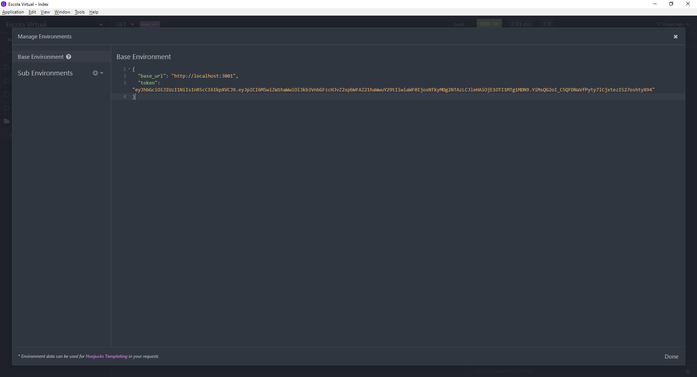

### Usuários
Token:

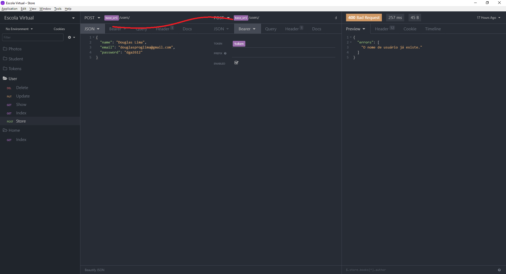

Cadastro:

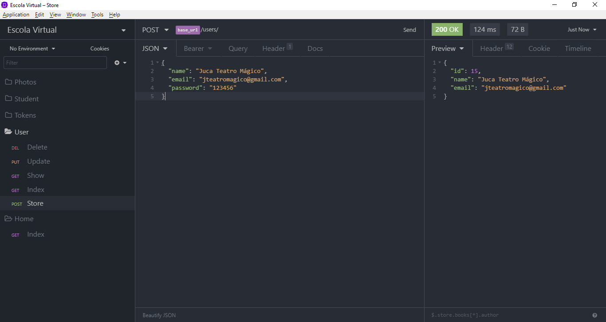

Listagem:

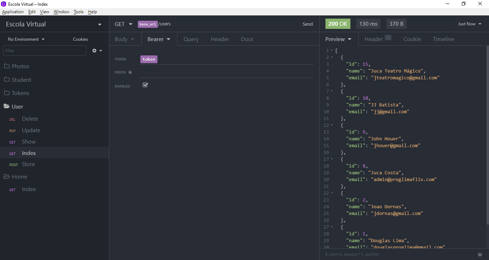

Listagem de Usuário por ID:

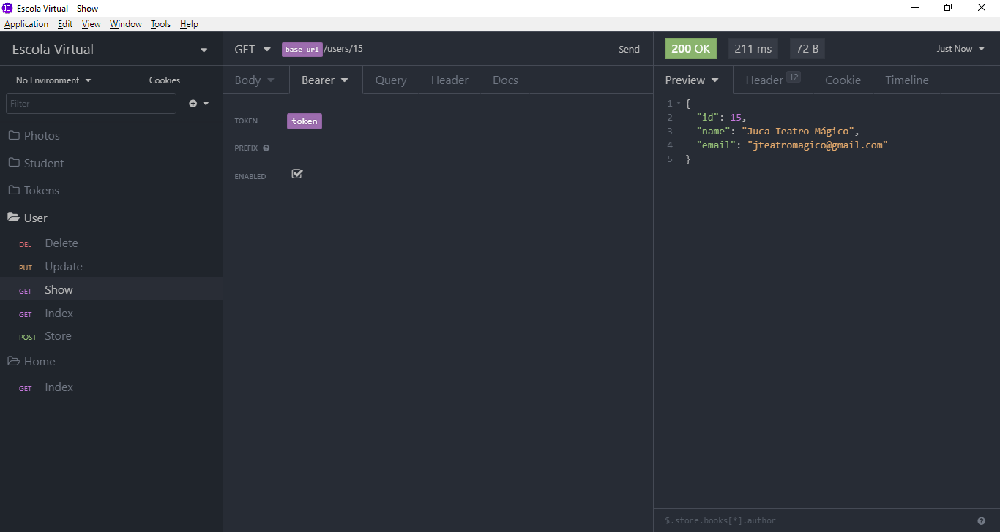

Alteração:

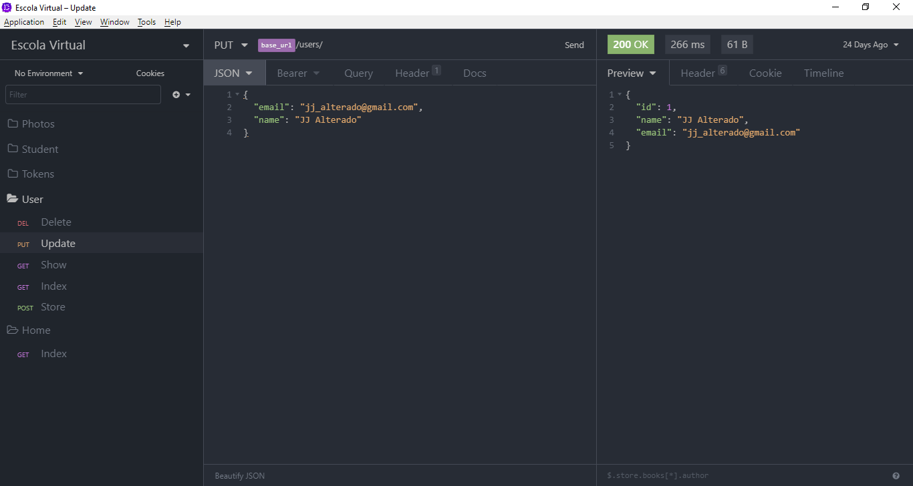

Exclusão:

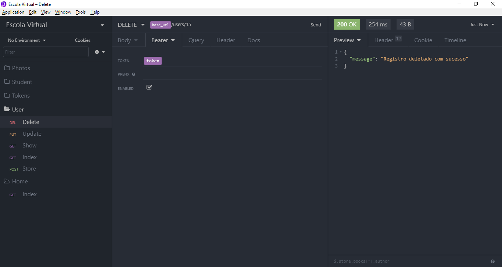

### Alunos

Cadastro:

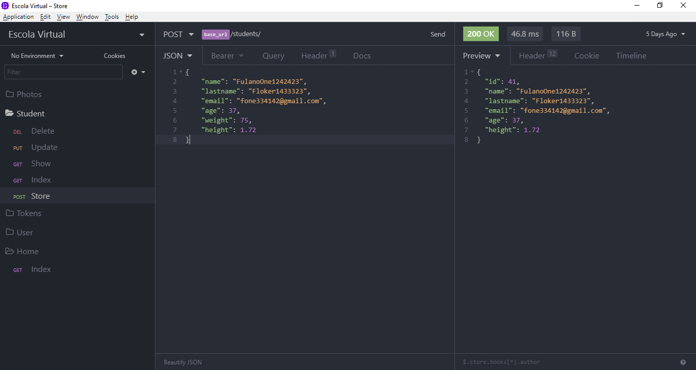

Listagem:

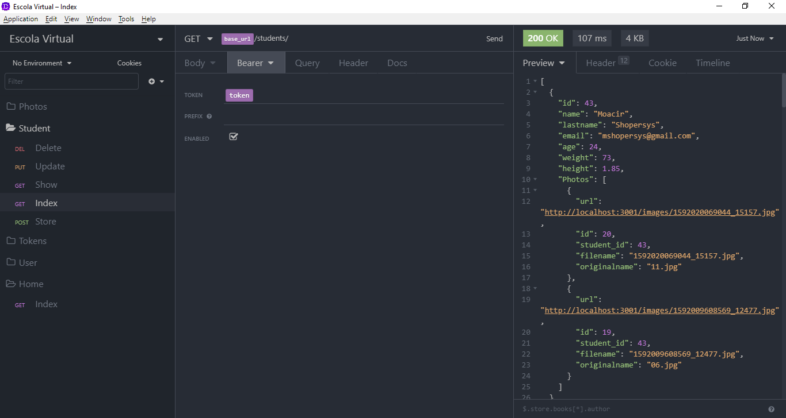

Listagem por ID:

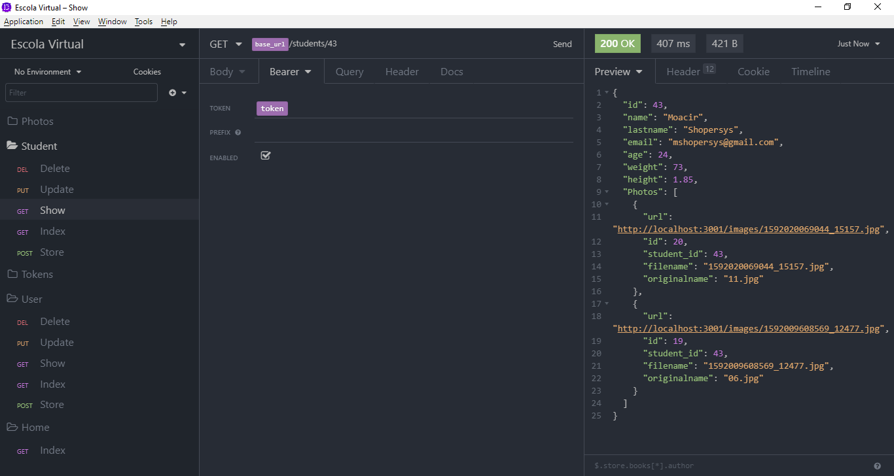

Atualização:

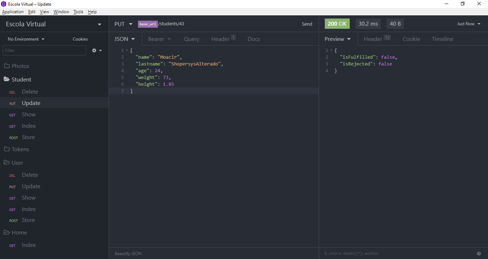

Exclusão:

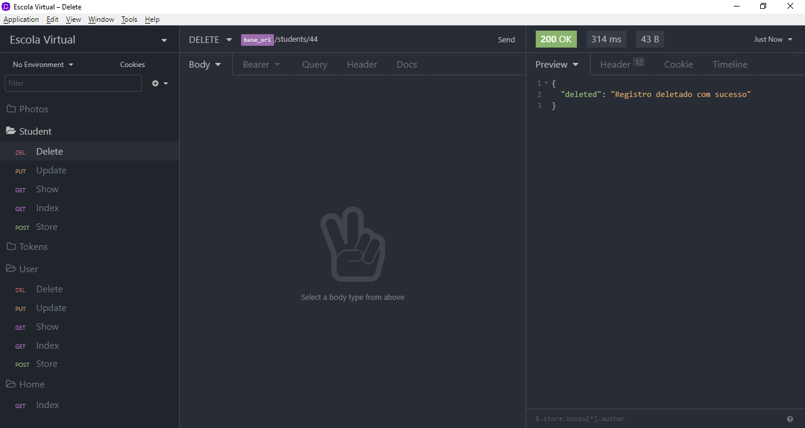

### Fotos do Aluno

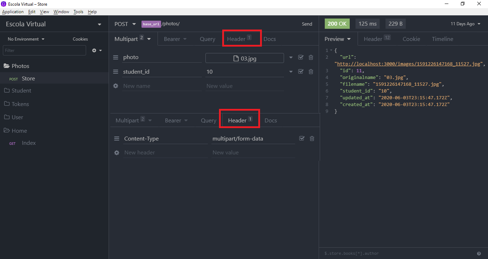